# HP Boosts

## Species HP% Boost

###### Gnole
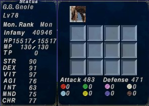
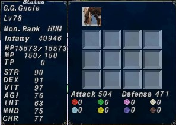

###### Coeurl
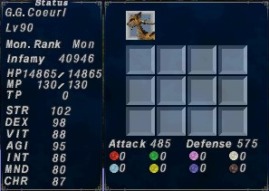
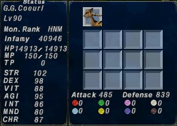

###### Lynx
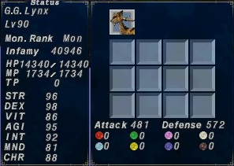
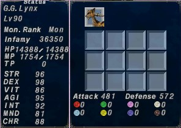

###### Collared Lynx
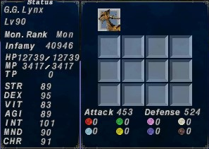
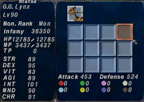

###### Smilodon
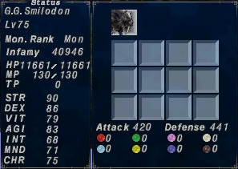
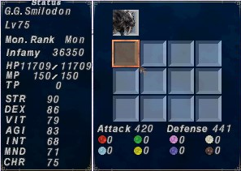

| Merits     | Gnole   | Coeurl  | Lynx    | Collared Lynx | Smilodon |
|:----------:|:-------:|:-------:|:-------:|:-------:|:-------:|
|  13HP      |**15517**|**14865**|**14340**|**12739**|**11661**|
|  15HP      |**15573**|**14913**|**14388**|**12785**|**11709**|
| Difference |  **56** |  **48** |  **48** |  **46** |  **48** |
| HP% Boost  |**+180%**|**+140%**|**+140%**|**+130%**|**+140%**|

## Instincts

### HP% Boosts being exact percentages

| Base HP    | Galka I + Galka II |  Gnole II | ⌊Base HP * 1.04⌋ |
|:----------:|:------------------:|:---------:|:---------------:|
| **15517**  | **16137**          | **16137** | **16137**       |

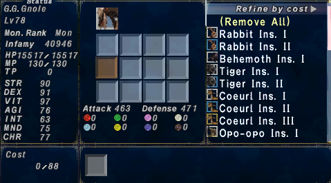
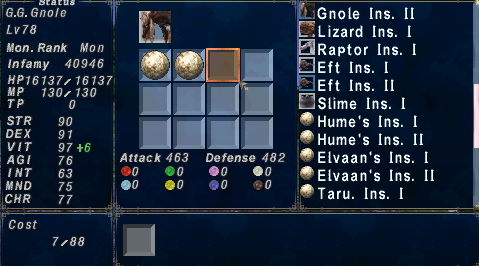
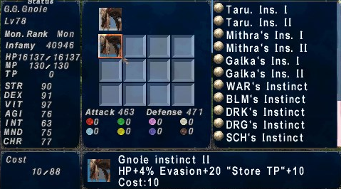

### HP% Boost being a single term instead of multiplicative

|     |  0% |  2% |  4% |  8% | 10% | 15% | 20% |
|:---:|:---:|:---:|:---:|:---:|:---:|:---:|:---:|
|Single Term| **15517** | **15827** | **16137** | **16758** | **17068** | **17844** | **18620** |
|All Multiplicative| **15517** | **15827** | **16143** | **16789** | **17127** | **17983** | **18893** |

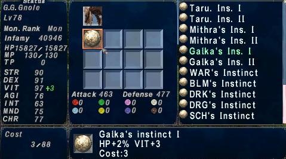

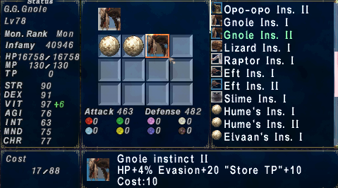
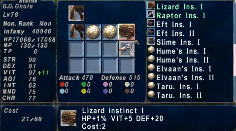
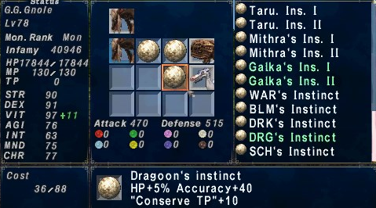
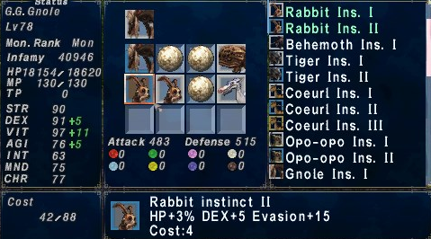