# HP Boosts

## Species HP% Boost

| Merits     | Gnole   | Coeurl  | Lynx    | Collared Lynx | Smilodon |
|:----------:|:-------:|:-------:|:-------:|:-------:|:-------:|
| Level      | 78      | 90      | 90      | 90      | 75      |
|  13HP      |**15517**|**14865**|**14340**|**12739**|**11661**|
|  15HP      |**15573**|**14913**|**14388**|**12785**|**11709**|
| Difference |  **56** |  **48** |  **48** |  **46** |  **48** |
| HP% Boost  |**+180%**|**+140%**|**+140%**|**+130%**|**+140%**|

Screenshots

###### Gnole

###### Coeurl
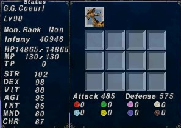
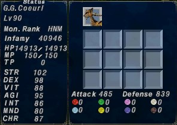

###### Lynx
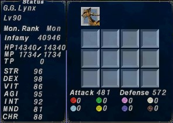
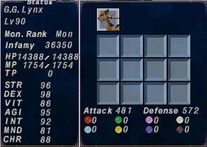

###### Collared Lynx
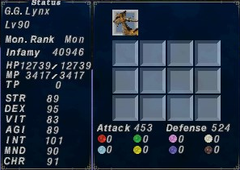
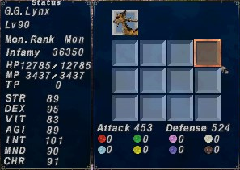

###### Smilodon
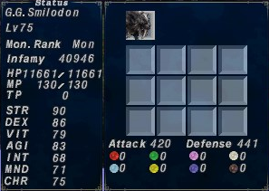
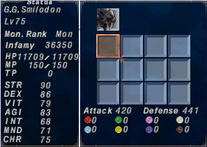

### Theorized Monster HP% Boost Values Based on HP Merits

Each HP merit increases player maximum HP by 10, but increases monster HP by a different amount depending on the monster.  
There appears to be a factor that multiplies max HP based upon monster family and the specific monster's main job.  
*This HP% Boost seems to be _additive_ with MNK's `Mantra` skill,  but _multiplicative_ with HP% Instincts.*

#### Theorized Max HP Formula
$$ MaxHP = BaseHP * (SpeciesHPBoost + MantraHPBoost) * \sum{InstinctHPBoost} $$

#### Theorized Base HP from Obseved Values
$$ BaseHP = MaxHP_{15M} / () $$

| Species           | Jobs      | Level| Max HP (15M) | Max HP (14M) | HP Lost | Theorized Base HP | HP Trait Boost | HP Merit Boost |
|:-----------------:|:---------:|:----:|:------------:|:------------:|:-------:|:-----------------:|:--------------:|:--------------:|
| Rabbit            | `WAR/WAR` | `75` | `10733` | `10711` | `22` | `4879` |
| Onyx Rabbit       | `WAR/BLM` | `75` | `10351` | `10329` | `22` | `4705` |
| Alabaster Rabbit  | `WAR/WHM` | `75` | `10434` | `10412` | `22` | `4743` |
| Tiger             | `WAR/WAR` | `75` | `11709` | `11685` | `24` | `4879` |
| Smilodon          | `WAR/WAR` | `75` | `11709` | `11685` | `24` | `4879` |
| Legendary Tiger   | `WHM/THF` | `75` | `9219`  | `9198`  | `21` | `4390` |
| Opo-Opo           | `WAR/WAR` | `75` | `11709` | `11685` | `24` | `4879` |
| Gnole             | `MNK/MNK` | `80` | `16058` | `16030` | `28` | `5735` |
| Coeurl            | `WAR/WAR` | `90` | `14913` | `14889` | `24` | `6213` |
| Lynx              | `WAR/BLM` | `90` | `14388` | `14364` | `24` | `5995` |
| Collared Lynx     | `RDM/BLM` | `90` | `12785` | `12762` | `23` | `5559` |

## Instincts

### HP% Boosts being exact percentages

*Demonstrating using stats for lv78 Gnole:*
| Base HP    | Galka I + Galka II |  Gnole II | ⌊Base HP * 1.04⌋ |
|:----------:|:------------------:|:---------:|:---------------:|
| **15517**  | **16137**          | **16137** | **16137**       |

Screenshots

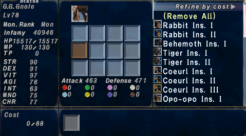
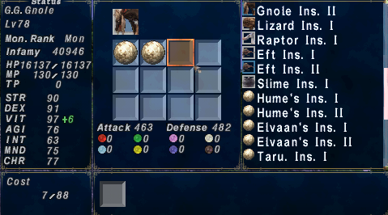
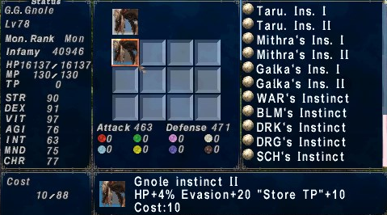

### HP% Boost being a single term instead of multiplicative

*Demonstrating using stats for lv78 Gnole:*
|     |  0% |  2% |  4% |  8% | 10% | 15% | 20% |
|:---:|:---:|:---:|:---:|:---:|:---:|:---:|:---:|
|Single Term| **15517** | **15827** | **16137** | **16758** | **17068** | **17844** | **18620** |
|All Multiplicative| **15517** | **15827** | **16143** | **16789** | **17127** | **17983** | **18893** |

Screenshots

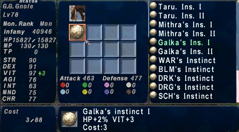

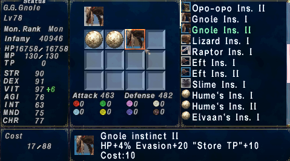
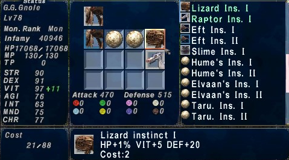
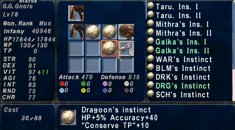
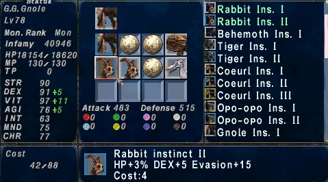

