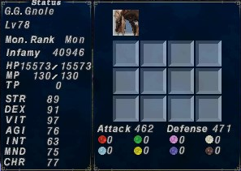

# Merits

## Merits affecting Monsters

*Demonstrating using stats for lv78 Gnole:*
|Merits        |  HP     |  MP   |  STR |
|:------------:|:-------:|:-----:|:----:|
| Full         |**15573**|**150**|**90**|
| 13HP + 13MP  |**15517**|**130**|**90**|
| 13MP + 14STR |**15573**|**130**|**89**|

*Attack varying is due to Gnoles receiving an attack boost that varies based on the phase of the moon, immaterial to the above point.*

  

  