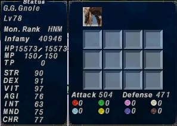
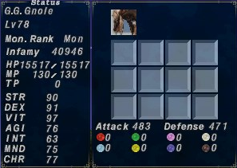
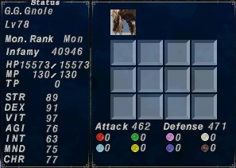

# Merits

## Merits affecting Monsters

### Stat Merits

It appears that monsters do benefit from merits but there are some extra systems in place to differentiate their gameplay from players.

Monsters fully benefit from all stat merits (including the quirk where jobs with no native MP still gain MP from merits), but there is an extra multiplier applied specifically only to HP merits.  
*This is discussed [here](/md/hp.MD).*

*Demonstrating using stats for lv78 Gnole:*
|Merits        |  HP     |  MP   |  STR |
|:------------:|:-------:|:-----:|:----:|
| Full         |**15573**|**150**|**90**|
| 13HP + 13MP  |**15517**|**130**|**90**|
| 13MP + 14STR |**15573**|**130**|**89**|

*Attack varying is due to Gnoles receiving an attack boost that varies based on the phase of the moon, immaterial to the above point.*

Screenshots of Level 78 Gnole stats

  

Gnole stats with maximum merits.  

Gnole stats with 13 HP merits and 13 MP merits.  

  

Gnole stats with 14 STR merits and 13 MP merits.  

